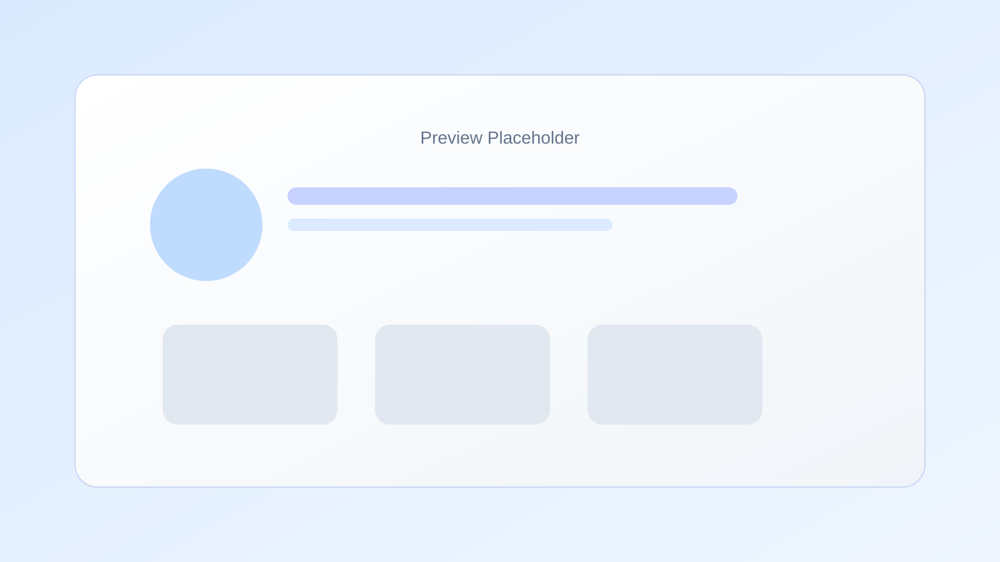

# 个人主页（my-profile）


一个以内容与体验为核心的个人主页，包含首屏介绍、关于我卡片、文章列表与联系模块。页面动效基于 Framer Motion，样式使用 Tailwind CSS，并通过 RSS 接口自动抓取文章摘要。

## 预览截图


## 技术栈
- Next.js 14（App Router）
- React 18
- Tailwind CSS
- Framer Motion
- fast-xml-parser（解析 RSS）

## 功能概览
- 首屏个人介绍与统计信息
- “关于我”卡片点击弹层展示详情
- 文章列表自动抓取与骨架占位
- 统一的入场动效与悬浮反馈

## 快速开始
```bash
npm install
npm run dev
```

可用脚本
```bash
npm run dev
npm run build
npm run start
npm run lint
```

## 部署说明
### 方式一：Vercel（推荐）
1. 在 Vercel 导入该仓库
2. Framework 选择 `Next.js`（通常可自动识别）
3. Build Command 使用 `npm run build`，Output 默认为 `.next`
4. 部署完成后即可访问

### 方式二：自托管（Node 服务）
```bash
npm install
npm run build
npm run start
```
默认在 `http://localhost:3000` 运行，可自行配置反向代理。

## 关键配置位置
- 主页布局与内容：`app/page.tsx`
- 全站样式与主题色：`app/globals.css`
- RSS 文章来源：`app/api/rss/route.ts`
- 头像图片：`public/avatar.jpg`

## 内容自定义
你可以在 `app/page.tsx` 中直接修改以下内容：
- `stats`：首屏统计信息
- `aboutCards`：关于我卡片的摘要内容
- `aboutDetails`：关于我弹层的详细内容（可单独编辑）

## 文章来源
RSS 来源在 `app/api/rss/route.ts` 的 `FEED_URL` 常量中配置。修改该地址即可切换抓取的文章源。

## 动效说明
- 列表卡片入场动效由 `container` / `item` 统一控制
- `useRevealOnView` 负责视口进入与兜底触发，避免刷新或定位时卡片不显示
- 关于我弹层使用 `AnimatePresence` 实现平滑进入与退出，背景模糊与卡片动效分离，减少卡顿

## 维护建议
- 如果调整主题色，建议仅修改 `app/globals.css` 中的 `--accent` 系列变量
- 如果需要扩展卡片数量，保持 `aboutCards` 与 `aboutDetails` 的顺序一致
